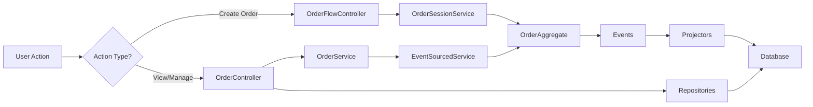

# Order Module Architecture Guide

## 🎯 Current Architecture: Hybrid System

The order module uses a **hybrid architecture** with two parallel systems working together:

### System 1: Event-Sourced Order Flow (Creation & Processing)
**Purpose:** Handle order creation, cart building, and order conversion  
**When Used:** Creating new orders, modifying cart, converting session to order

```
📁 Core Components:
├── Controllers/
│   ├── Web/OrderFlowController.php     # Session-based web flow
│   ├── Web/OrderSyncController.php     # Unified sync endpoint
│   └── Api/OrderFlowController.php     # API endpoints for mobile
├── Services/
│   ├── OrderSessionService.php         # Session management
│   └── EventSourcedOrderService.php    # Event sourcing orchestration
├── Aggregates/
│   └── OrderAggregate.php              # Event sourcing aggregate root
├── Events/                             # ALL events are ACTIVE
│   ├── Session/*.php                   # Session-specific events
│   └── *.php                          # Order lifecycle events
├── Projectors/                         # Update read models from events
│   ├── OrderProjector.php
│   ├── OrderSessionProjector.php
│   └── OrderFromSessionProjector.php
└── ProcessManagers/
    └── TakeOrderProcessManager.php     # Orchestrate complex flows
```

### System 2: Traditional CRUD Layer (Display & Management)
**Purpose:** Display orders, manage status transitions, dashboards, reporting  
**When Used:** Viewing orders, updating status, generating reports

```
📁 Core Components:
├── Controllers/
│   ├── Web/OrderController.php         # Display pages, status updates
│   └── Api/OrderController.php         # REST API for queries
├── Services/
│   ├── OrderService.php                # Business logic (wraps EventSourcedService)
│   ├── OrderValidationService.php      # Validate order data
│   ├── OrderCalculationService.php     # Calculate totals
│   └── EventStreamService.php          # Event history viewing
├── Repositories/
│   ├── OrderRepository.php             # Database queries
│   └── OrderItemRepository.php         # Order items queries
└── Data/                               # DTOs for both systems
    ├── CreateOrderData.php             # Traditional creation DTO
    ├── UpdateOrderData.php             # Traditional update DTO
    ├── ModifyOrderData.php             # Traditional modification DTO
    ├── OrderFlowResponseData.php      # Flow response DTO
    └── Session/*.php                   # Session-specific DTOs
```

## 🔄 How They Work Together



## ❗ Why Both Systems Exist

1. **Event Sourcing (System 1)** provides:
   - Perfect audit trail
   - Offline-first mobile support
   - Complex multi-step flows
   - Event replay capabilities
   - Resilience to failures

2. **Traditional Layer (System 2)** provides:
   - Fast read queries for dashboards
   - Simple status management UI
   - Familiar REST API patterns
   - Easy reporting and analytics
   - Quick display pages

## 📋 File Purpose Quick Reference

### ✅ ALL These Files Are NEEDED:

| File | System | Purpose |
|------|--------|---------|
| OrderController | Traditional | Display orders, manage status |
| OrderFlowController | Event-Sourced | Create orders via sessions |
| OrderService | Traditional | Orchestrates business logic, wraps EventSourcedService |
| OrderSessionService | Event-Sourced | Manages order sessions |
| EventSourcedOrderService | Event-Sourced | Core event sourcing logic |
| OrderValidationService | Traditional | Validates for OrderService |
| OrderCalculationService | Traditional | Calculates for OrderService |
| OrderAggregate | Event-Sourced | Aggregate root for events |
| All Events/*.php | Event-Sourced | Domain events (ALL are used) |
| All Projectors/*.php | Event-Sourced | Update read models |
| All Data/*.php | Both | DTOs for validation/transfer |

## 🚫 Common Misconceptions

1. **"OrderModified event is too generic"** - It's used for specific modifications that don't fit other events
2. **"OrderService duplicates EventSourcedOrderService"** - OrderService wraps and extends it for display needs
3. **"Two controllers do the same thing"** - They serve different purposes (creation vs management)
4. **"Some DTOs are redundant"** - Different DTOs serve different validation rules

## 🎯 Future Direction

Eventually, the goal is to:
1. Fully migrate all operations to event sourcing
2. Use CQRS with separate read models
3. Remove the traditional layer

But for now, **both systems are required** for the application to function properly.

## 🔍 How to Navigate

- **Creating orders?** Look in OrderFlowController and OrderSessionService
- **Displaying orders?** Look in OrderController and OrderService  
- **Adding new events?** Add to Events/ and handle in OrderAggregate + Projectors
- **Adding new queries?** Add to OrderService and OrderRepository