# Order Flow Diagram - Sequential Process

## Overview
The order module uses Event Sourcing to track the complete lifecycle of an order from session initiation to completion. This provides perfect offline-first support, complete audit trail, and resilient async processing.

## 🎯 Quick Reference - Key Entry Points

### Main Controllers
| Controller | File Path | Purpose |
|------------|-----------|---------|
| **OrderFlowController** | `src/Http/Controllers/Web/OrderFlowController.php` | Session management & cart operations |
| **OrderController (API)** | `src/Http/Controllers/Api/OrderController.php` | REST API for orders |
| **OrderSyncController** | `src/Http/Controllers/Web/OrderSyncController.php` | Sync operations |

### Core Services & Aggregates
| Component | File Path | Key Methods |
|-----------|-----------|-------------|
| **OrderSessionService** | `src/Services/OrderSessionService.php:23` | `startSession()`, `convertToOrder():348` |
| **OrderAggregate** | `src/Aggregates/OrderAggregate.php` | `initiateSession():89`, `startOrder():400`, `confirmOrder():523` |
| **OrderService** | `src/Services/OrderService.php` | Business logic implementation |
| **TakeOrderProcessManager** | `src/ProcessManagers/TakeOrderProcessManager.php` | Event orchestration |

### Key Starting Points
```
1. New Session:     OrderFlowController::startSession() → Line 19
2. Add to Cart:     OrderFlowController::addToCart() → Line 82  
3. Convert to Order: OrderFlowController::convertToOrder() → Line 169
4. Direct Order:    OrderController::store() → Line 81
```

## 📊 Complete Order Flow Sequence

```mermaid
graph TD
    Start([User Opens Order Page]) --> S1[Session Initiation]
    
    %% Session Phase
    S1 --> S2[Session Created<br/>UUID Generated]
    S2 --> S3[Location & Business Context Set]
    S3 --> S4[Device Info Captured]
    
    %% Browsing Phase
    S4 --> B1[Item Browsing Phase]
    B1 --> B2{User Action}
    B2 -->|Search| B3[Item Search<br/>Event: ItemSearched]
    B2 -->|Browse| B4[Category Browse<br/>Event: CategoryBrowsed]
    B2 -->|View| B5[Item View<br/>Event: ItemViewed]
    B3 --> B6[Add to Cart]
    B4 --> B6
    B5 --> B6
    
    %% Cart Building Phase
    B6 --> C1[Cart Building Phase]
    C1 --> C2[Event: ItemAddedToCart]
    C2 --> C3{Cart Actions}
    C3 -->|Add More| C2
    C3 -->|Remove| C4[Event: ItemRemovedFromCart]
    C3 -->|Modify| C5[Event: CartModified]
    C3 -->|Continue| C6[Cart Complete]
    C4 --> C3
    C5 --> C3
    
    %% Order Details Phase
    C6 --> D1[Order Details Phase]
    D1 --> D2[Select Serving Type<br/>Event: ServingTypeSelected]
    D2 --> D3{Serving Type}
    D3 -->|Dine In| D4[Table Number Entry]
    D3 -->|Delivery| D5[Delivery Address Entry]
    D3 -->|Takeout| D6[Skip Location Details]
    D4 --> D7
    D5 --> D7
    D6 --> D7[Customer Info Entry<br/>Event: CustomerInfoEntered]
    D7 --> D8[Payment Method Selection<br/>Event: PaymentMethodSelected]
    
    %% Session to Order Conversion
    D8 --> O1[Convert Session to Order]
    O1 --> O2[Generate New Order UUID]
    O2 --> O3[Event: OrderStarted]
    
    %% Order Processing Phase
    O3 --> P1[Order Processing Phase]
    P1 --> P2[Add Items to Order<br/>Event: ItemsAddedToOrder]
    P2 --> P3[Validate Items<br/>Event: ItemsValidated]
    P3 --> P4{Validation Result}
    P4 -->|Failed| P5[Event: ItemValidationFailed]
    P4 -->|Success| P6[Calculate Promotions<br/>Event: PromotionsCalculated]
    P5 --> ERR1[Show Error to User]
    ERR1 --> C1
    
    %% Pricing Phase
    P6 --> PR1[Pricing Phase]
    PR1 --> PR2{Has Promotions?}
    PR2 -->|Yes| PR3[Apply Promotions<br/>Event: PromotionApplied]
    PR2 -->|No| PR4[Calculate Price]
    PR3 --> PR4[Calculate Final Price<br/>Event: PriceCalculated]
    PR4 --> PR5{Add Tip?}
    PR5 -->|Yes| PR6[Event: TipAdded]
    PR5 -->|No| PR7[Confirm Order]
    PR6 --> PR7
    
    %% Order Confirmation Phase
    PR7 --> CF1[Order Confirmation]
    CF1 --> CF2[Event: OrderConfirmed]
    CF2 --> CF3[Generate Order Number]
    CF3 --> CF4[Update Session Status<br/>to 'converted']
    
    %% Post-Confirmation States
    CF4 --> PC1[Post-Confirmation Phase]
    PC1 --> PC2{Order Status}
    PC2 -->|Process| PC3[Status: Preparing<br/>Event: OrderStatusTransitioned]
    PC2 -->|Cancel| PC4[Status: Cancelled<br/>Event: OrderCancelled]
    PC3 --> PC5[Status: Ready<br/>Event: OrderStatusTransitioned]
    PC5 --> PC6[Status: Delivered<br/>Event: OrderStatusTransitioned]
    PC6 --> PC7[Status: Completed<br/>Event: OrderStatusTransitioned]
    
    %% Payment Processing
    PC7 --> PAY1[Payment Processing]
    PAY1 --> PAY2{Payment Result}
    PAY2 -->|Success| PAY3[Event: PaymentProcessed]
    PAY2 -->|Failed| PAY4[Event: PaymentFailed]
    PAY3 --> END([Order Complete])
    PAY4 --> PAY5[Retry Payment]
    PAY5 --> PAY1
    
    %% Modification Flow
    PC3 -.->|Can Modify| MOD1[Order Modification]
    MOD1 --> MOD2{Modification Type}
    MOD2 -->|Items| MOD3[Event: ItemsModified]
    MOD2 -->|Price| MOD4[Event: PriceAdjusted]
    MOD2 -->|Customer| MOD5[Event: CustomerInfoUpdated]
    MOD2 -->|Modifiers| MOD6[Event: ItemModifiersChanged]
    MOD3 --> PC3
    MOD4 --> PC3
    MOD5 --> PC3
    MOD6 --> PC3
```



## 📋 State Transitions

### Session States
| State | Description | Next States |
|-------|-------------|-------------|
| `session_initiated` | Session started, location set | `cart_building`, `abandoned` |
| `cart_building` | Items being added to cart | `details_collecting`, `abandoned` |
| `details_collecting` | Customer info being entered | `converting`, `abandoned` |
| `converting` | Session converting to order | `converted`, `failed` |
| `converted` | Successfully converted to order | - |
| `abandoned` | Session abandoned | - |

### Order States
| State | Description | Next States |
|-------|-------------|-------------|
| `draft` | Order created but not started | `started`, `cancelled` |
| `started` | Order initiated with location/staff | `items_added`, `cancelled` |
| `items_added` | Items added to order | `items_validated`, `cancelled` |
| `items_validated` | Items validated and priced | `promotions_calculated`, `cancelled` |
| `promotions_calculated` | Promotions calculated | `price_calculated`, `cancelled` |
| `price_calculated` | Final price calculated | `confirmed`, `cancelled` |
| `confirmed` | Order confirmed by customer | `preparing`, `cancelled` |
| `preparing` | Kitchen preparing order | `ready`, `cancelled` |
| `ready` | Order ready for pickup/delivery | `delivering`, `completed`, `cancelled` |
| `delivering` | Order being delivered | `delivered`, `cancelled` |
| `delivered` | Order delivered to customer | `completed` |
| `completed` | Order successfully completed | `refunded` |
| `cancelled` | Order cancelled | - |
| `refunded` | Order refunded | - |

## 🎯 Key Event Types

### Session Events
- `OrderSessionInitiated` - Session starts
- `ItemSearched` - User searches for items
- `CategoryBrowsed` - User browses category
- `ItemViewed` - User views item details
- `ItemAddedToCart` - Item added to cart
- `ItemRemovedFromCart` - Item removed from cart
- `CartModified` - Cart item modified
- `ServingTypeSelected` - Dine-in/takeout/delivery selected
- `CustomerInfoEntered` - Customer details entered
- `PaymentMethodSelected` - Payment method chosen
- `OrderDraftSaved` - Draft saved (auto or manual)
- `SessionAbandoned` - Session abandoned

### Order Events
- `OrderStarted` - Order creation initiated
- `ItemsAddedToOrder` - Items added to order
- `ItemsValidated` - Items validated for availability/price
- `PromotionsCalculated` - Available promotions calculated
- `PromotionApplied` - Promotion applied to order
- `PriceCalculated` - Final price calculated
- `TipAdded` - Tip added to order
- `PaymentMethodSet` - Payment method set
- `OrderConfirmed` - Order confirmed
- `OrderStatusTransitioned` - Status changed
- `OrderCancelled` - Order cancelled

### Modification Events
- `ItemsModified` - Order items modified
- `PriceAdjusted` - Price adjusted (discount/surcharge)
- `CustomerInfoUpdated` - Customer info updated
- `ItemModifiersChanged` - Item modifiers changed
- `OrderItemsUpdated` - Items updated from web

### Payment Events
- `PaymentProcessed` - Payment successful
- `PaymentFailed` - Payment failed

## 🔄 Process Flow Details

### 1. Session Initiation
```
User Opens Order Page
    ↓
OrderFlowController::startSession()
📁 src/Http/Controllers/Web/OrderFlowController.php:19
    ↓
OrderSessionService::startSession()
📁 src/Services/OrderSessionService.php:23
    ↓
OrderAggregate::initiateSession()
📁 src/Aggregates/OrderAggregate.php:89
    ↓
Event: OrderSessionInitiated
📁 src/Events/Session/OrderSessionInitiated.php
    ↓
OrderSession record created
📁 src/Models/OrderSession.php
```

### 2. Cart Building
```
User Adds Item
    ↓
OrderFlowController::addToCart()
📁 src/Http/Controllers/Web/OrderFlowController.php:82
    ↓
OrderSessionService::addToCart()
📁 src/Services/OrderSessionService.php:180
    ↓
OrderAggregate::addToCart()
📁 src/Aggregates/OrderAggregate.php:181
    ↓
Event: ItemAddedToCart
📁 src/Events/Session/ItemAddedToCart.php
    ↓
Cart state updated in aggregate
📁 src/Aggregates/OrderAggregate.php:1362
```

### 3. Session to Order Conversion
```
User Confirms Cart
    ↓
OrderFlowController::convertToOrder()
📁 src/Http/Controllers/Web/OrderFlowController.php:169
    ↓
OrderSessionService::convertToOrder()
📁 src/Services/OrderSessionService.php:348
    ↓
Create NEW Order UUID (different from session UUID)
📁 src/Services/OrderSessionService.php:363
    ↓
OrderAggregate::startOrder() [with new UUID]
📁 src/Aggregates/OrderAggregate.php:400
    ↓
OrderAggregate::addItems() [from cart]
📁 src/Aggregates/OrderAggregate.php:423
    ↓
OrderAggregate::markItemsAsValidated()
📁 src/Aggregates/OrderAggregate.php:444
    ↓
OrderAggregate::setPaymentMethod()
📁 src/Aggregates/OrderAggregate.php:514
    ↓
OrderAggregate::confirmOrder()
📁 src/Aggregates/OrderAggregate.php:523
    ↓
Event: OrderConfirmed
📁 src/Events/OrderConfirmed.php
    ↓
Order record created in database
📁 src/Projectors/OrderProjector.php (handles event)
    ↓
Session marked as 'converted'
📁 src/Services/OrderSessionService.php:434
```

### 4. Order Processing
```
Order Confirmed
    ↓
ProcessManager listens to events
📁 src/ProcessManagers/TakeOrderProcessManager.php:207
    ↓
Cross-module validation (if needed)
📁 src/ProcessManagers/TakeOrderProcessManager.php:128
    ↓
Kitchen notification
📁 src/Services/OrderService.php (notifyKitchen method)
    ↓
Status transitions through states
📁 src/States/OrderState.php (base class)
📁 src/States/[ConfirmedState.php, PreparingState.php, etc.]
    ↓
Payment processing
📁 src/Aggregates/OrderAggregate.php:672
    ↓
Order completion
📁 src/Http/Controllers/Api/OrderController.php:174
```

## 🔧 API Endpoints & Entry Points

### Session Management
| Endpoint | File:Line | Method |
|----------|-----------|--------|
| `POST /order-flow/start-session` | `OrderFlowController.php:19` | `startSession()` |
| `POST /order-flow/{uuid}/track` | `OrderFlowController.php:46` | `trackEvent()` |
| `POST /order-flow/{uuid}/add-to-cart` | `OrderFlowController.php:82` | `addToCart()` |
| `POST /order-flow/{uuid}/remove-from-cart` | `OrderFlowController.php:101` | `removeFromCart()` |
| `POST /order-flow/{uuid}/update-cart-item` | `OrderFlowController.php:118` | `updateCartItem()` |
| `GET /order-flow/{uuid}/state` | `OrderFlowController.php:135` | `getSessionState()` |
| `POST /order-flow/{uuid}/recover` | `OrderFlowController.php:145` | `recoverSession()` |
| `POST /order-flow/{uuid}/save-draft` | `OrderFlowController.php:155` | `saveDraft()` |
| `POST /order-flow/{uuid}/convert` | `OrderFlowController.php:169` | `convertToOrder()` |

### Order Management  
| Endpoint | File:Line | Method |
|----------|-----------|--------|
| `GET /api/orders` | `OrderController.php:31` | `index()` |
| `POST /api/orders` | `OrderController.php:81` | `store()` |
| `GET /api/orders/{id}` | `OrderController.php:108` | `show()` |
| `PUT /api/orders/{id}` | `OrderController.php:130` | `update()` |
| `POST /api/orders/{id}/status` | `OrderController.php:161` | `updateStatus()` |
| `POST /api/orders/{id}/cancel` | `OrderController.php:191` | `cancel()` |
| `POST /api/orders/{id}/items/{itemId}/status` | `OrderController.php:237` | `updateItemStatus()` |
| `POST /api/orders/{id}/offers` | `OrderController.php:272` | `applyOffers()` |
| `GET /api/orders/{id}/next-states` | `OrderController.php:299` | `getNextStates()` |

## 💡 Key Implementation Notes

1. **Two UUIDs**: Session UUID ≠ Order UUID (generated separately)
2. **Event Sourcing**: Complete audit trail of all actions
3. **Offline-First**: Events can be replayed for synchronization
4. **State Machine**: Strict state transitions prevent invalid operations
5. **Cross-Module**: Uses interfaces for item/promotion validation
6. **Process Manager**: Orchestrates complex async flows
7. **Projectors**: React to events for cross-module communication
8. **Cache-Based**: Process state stored in cache during flow
9. **Modification Tracking**: Count and history of all changes
10. **Payment Decoupled**: Payment processing is async/retryable

## 🚀 Benefits of Event-Sourced Architecture

- **Resilience**: No deadlocks, self-healing through replay
- **Audit Trail**: Complete history of all actions
- **Time Travel**: Can reconstruct state at any point
- **Analytics**: Rich behavioral data from events
- **Debugging**: Easy to trace issues through event stream
- **Multi-Version**: Old and new clients can coexist
- **CQRS Ready**: Read models can be optimized separately
- **Eventual Consistency**: Modules stay loosely coupled