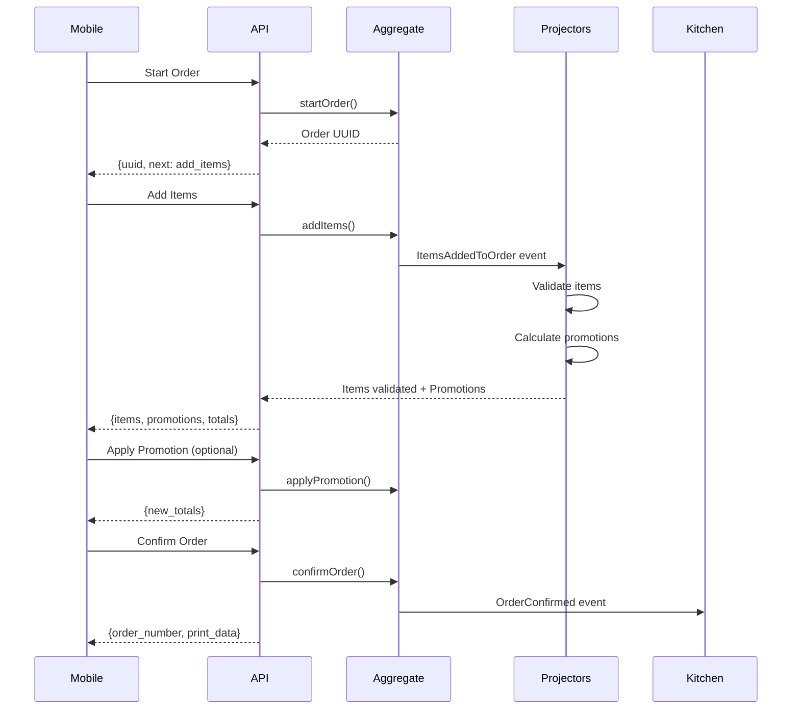

# Event-Sourced Order Flow Architecture

## Overview

This implementation uses **Event Sourcing** with `spatie/laravel-event-sourcing` to create a robust, scalable order-taking flow that handles multiple rounds of server-client communication for real-time promotions, validations, and updates.

## Key Components

### 1. OrderAggregate (Event Source)
- Single source of truth for order state
- Records all order actions as events
- Provides replay capability for debugging and recovery
- Located: `app-modules/order/src/Aggregates/OrderAggregate.php`

### 2. Events (What Happened)
- `OrderStarted` - Waiter begins taking order
- `ItemsAddedToOrder` - Items added to cart
- `ItemsValidated` - Items checked for availability/stock
- `PromotionsCalculated` - Available promotions determined
- `PromotionApplied/Removed` - Customer selects promotions
- `PriceCalculated` - Final pricing computed
- `TipAdded` - Tip added to order
- `PaymentMethodSet` - Payment method selected
- `OrderConfirmed` - Order sent to kitchen
- `OrderCancelled` - Order cancelled

### 3. Projectors (Cross-Module Communication)
- **OrderProjector**: Updates read model (database)
- **ItemValidationProjector**: Validates items exist, available, in stock
- **PromotionCalculatorProjector**: Calculates applicable promotions

### 4. Process Manager (Synchronous API)
- Manages request-response flow for mobile apps
- Tracks process state across async events
- Provides polling/recovery mechanisms
- Handles timeouts gracefully

### 5. API Endpoints
```
POST /api/orders/flow/start         - Start new order
POST /api/orders/flow/{uuid}/items  - Add items (triggers validation + promotions)
POST /api/orders/flow/{uuid}/promotion - Apply/remove promotion
POST /api/orders/flow/{uuid}/tip    - Add tip
POST /api/orders/flow/{uuid}/confirm - Confirm order
POST /api/orders/flow/{uuid}/cancel - Cancel order
GET  /api/orders/flow/{uuid}/state  - Get current state (polling/recovery)
```

## Mobile App Flow



## Key Benefits

### 1. **Resilience**
- No deadlocks during peak hours (async event processing)
- Partial failures don't crash the system
- Self-healing through event replay

### 2. **Offline-First**
- Mobile devices can create events offline
- Sync when reconnected (idempotent processing)
- Perfect audit trail

### 3. **Multi-Version Support**
- Old and new mobile app versions coexist
- Event versioning handles schema changes
- No forced updates

### 4. **Debugging & Recovery**
- Complete audit trail of all actions
- Can replay any order to debug issues
- Time-travel debugging capability

### 5. **Scalability**
- Modules communicate asynchronously
- No direct dependencies between modules
- Easy to add new modules/features

## Testing

Comprehensive test coverage includes:
- Full order flow with promotions
- Item validation failures
- Concurrent modifications
- Event replay scenarios
- Order cancellation
- Offline sync simulation
- Idempotency verification

Run tests:
```bash
sail artisan test --filter TakeOrderFlowTest
```

## Migration Path

To enable this architecture:

1. Install event sourcing tables:
```bash
sail artisan event-sourcing:create-stored-event-migration
sail artisan migrate
```

2. Register projectors in `EventSourcingServiceProvider`:
```php
Projectionist::addProjector(OrderProjector::class);
Projectionist::addProjector(ItemValidationProjector::class);
Projectionist::addProjector(PromotionCalculatorProjector::class);
Projectionist::addReactor(TakeOrderProcessManager::class);
```

3. Configure event storage in `config/event-sourcing.php`

## Monitoring

Key metrics to track:
- Event processing time
- Process completion rate
- Promotion application rate
- Order confirmation time
- Failed validation rate

## Future Enhancements

1. **WebSocket Updates**: Real-time order status to mobile
2. **Saga Compensation**: Auto-rollback on failures
3. **Event Streaming**: Kafka/RabbitMQ for scale
4. **CQRS Read Models**: Optimized projections for queries
5. **Event Versioning**: Schema evolution support