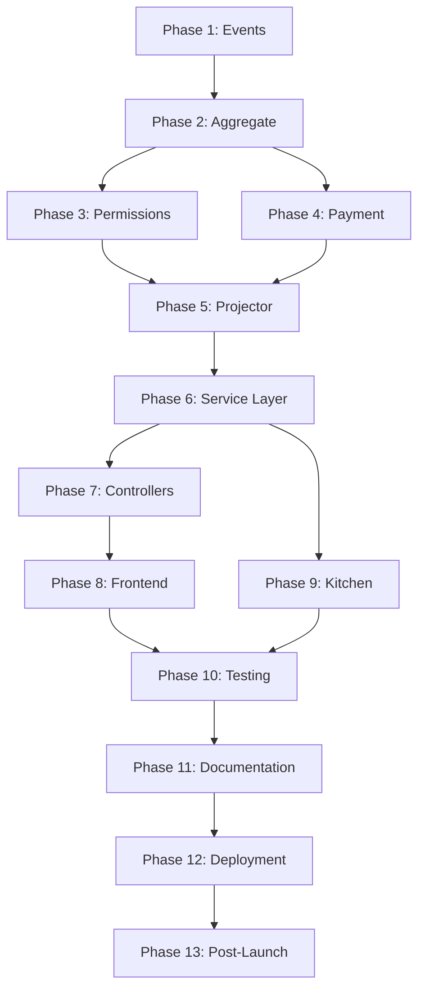

# Order Editing Implementation Checklist - Plan B

## Phase 0: Foundation Analysis & Setup ✅
**Goal**: Understand existing system and prepare groundwork

### Pre-Implementation Research
- [x] Analyze existing OrderModified event structure
- [ ] Review OrderProjector for projection patterns
- [ ] Study TakeOrderProcessManager for process flows
- [ ] Examine staff module for role definitions
- [ ] Document current order state transitions
- [ ] Map existing payment flows

### Development Environment Setup
- [ ] Create feature branch: `feature/order-editing-compensating-events`
- [ ] Set up test database with sample orders in various states
- [ ] Configure feature flag: `order.editing.enabled`
- [ ] Create test scenarios document
- [ ] Set up monitoring for event replay performance

### Critical Questions to Answer
- [ ] What happens to orders with partial payments?
- [ ] How do we handle tips when order total changes?
- [ ] Should kitchen be notified of price-only changes?
- [ ] What's the maximum time window for modifications?
- [ ] How do we handle concurrent modifications?
- [ ] What audit fields are legally required?

---

## Phase 1: Event Infrastructure 🏗️
**Goal**: Create robust event system for modifications

### 1.1 Core Event Classes
```php
// app-modules/order/src/Events/
```

- [ ] Create `ItemsModified` event
  - [ ] Properties: addedItems, removedItems, modifiedItems
  - [ ] Include: modifiedBy, reason, timestamp
  - [ ] Add: previousTotal, newTotal for quick reference
  - [ ] Include: requiresKitchenNotification flag

- [ ] Create `PriceAdjusted` event
  - [ ] Properties: adjustmentType, amount, reason
  - [ ] Include: authorizedBy (for manager overrides)
  - [ ] Add: affectsPayment boolean

- [ ] Create `ModificationReverted` event (for error recovery)
  - [ ] Properties: originalEventId, revertReason
  - [ ] Include: revertedBy, timestamp

### 1.2 Event Validation
- [ ] Implement event payload validation
- [ ] Add business rule checks in events
- [ ] Create event versioning strategy
- [ ] Add idempotency keys to prevent duplicates

### 1.3 Event Metadata
- [ ] Add correlation IDs for related events
- [ ] Include client device info (web/mobile)
- [ ] Add location/terminal information
- [ ] Include staff shift information

---

## Phase 2: Aggregate Implementation 📊
**Goal**: Implement modification logic in OrderAggregate

### 2.1 Core Modification Methods
```php
// app-modules/order/src/Aggregates/OrderAggregate.php
```

- [ ] Implement `modifyItems()` method
  - [ ] Validate current status allows modification
  - [ ] Calculate item differences
  - [ ] Verify item availability
  - [ ] Record ItemsModified event

- [ ] Implement `adjustPrice()` method
  - [ ] Validate adjustment limits
  - [ ] Check authorization requirements
  - [ ] Record PriceAdjusted event

- [ ] Implement `revertModification()` method
  - [ ] Validate reversion is possible
  - [ ] Calculate compensating changes
  - [ ] Record ModificationReverted event

### 2.2 State Management
- [ ] Update internal state tracking
  - [ ] Add `modificationCount` property
  - [ ] Track `lastModifiedAt` timestamp
  - [ ] Maintain `modificationHistory` array

- [ ] Implement modification rules
  - [ ] `canBeModified()`: Check if status allows changes
  - [ ] `getModificationRestrictions()`: Return what changes are allowed
  - [ ] `requiresAuthorization()`: Check if manager approval needed

### 2.3 Business Rule Enforcement
- [ ] Maximum modifications per order limit
- [ ] Time window restrictions (e.g., no edits after 30 minutes)
- [ ] Minimum order amount validation
- [ ] Promotion recalculation triggers
- [ ] Tax recalculation logic

---

## Phase 3: Permission System 🔐
**Goal**: Implement granular permission control

### 3.1 Permission Service
```php
// app-modules/order/src/Services/OrderEditPermissionService.php
```

- [ ] Create permission evaluation service
  ```php
  getEditPermissions($order, $user): EditPermissions
  canAddItems($order, $user): bool
  canRemoveItems($order, $user): bool
  canAdjustPrice($order, $user): bool
  getMaxDiscountPercent($user): float
  ```

### 3.2 Permission Matrix Implementation

| Role | Draft | Placed | Confirmed | Preparing | Ready | Delivered | Completed |
|------|-------|--------|-----------|-----------|-------|-----------|-----------|
| **Waiter** |
| - [ ] Add Items | ✅ | ✅ | ✅ | ⚠️ | ❌ | ❌ | ❌ |
| - [ ] Remove Items | ✅ | ✅ | ❌ | ❌ | ❌ | ❌ | ❌ |
| - [ ] Modify Qty | ✅ | ✅ | ⚠️ | ❌ | ❌ | ❌ | ❌ |
| - [ ] Cancel | ✅ | ✅ | ❌ | ❌ | ❌ | ❌ | ❌ |
| **Supervisor** |
| - [ ] All Waiter + | ✅ | ✅ | ✅ | ✅ | ❌ | ❌ | ❌ |
| - [ ] Price Adjust | ✅ | ✅ | ✅ | ✅ | ✅ | ✅ | ❌ |
| - [ ] Cancel | ✅ | ✅ | ✅ | ✅ | ❌ | ❌ | ❌ |
| **Manager** |
| - [ ] All Actions | ✅ | ✅ | ✅ | ✅ | ✅ | ✅ | ✅ |
| - [ ] Void After Payment | ✅ | ✅ | ✅ | ✅ | ✅ | ✅ | ✅ |

### 3.3 Authorization Tracking
- [ ] Log all permission checks
- [ ] Record authorization overrides
- [ ] Implement authorization codes for sensitive operations
- [ ] Create permission denial reasons

---

## Phase 4: Payment Reconciliation 💳
**Goal**: Handle payment adjustments seamlessly

### 4.1 Payment Difference Calculator
```php
// app-modules/order/src/Services/PaymentReconciliationService.php
```

- [ ] Calculate payment differences
  ```php
  calculateDifference($originalOrder, $modifiedOrder): Money
  determineReconciliationStrategy($order, $difference): Strategy
  ```

- [ ] Implement reconciliation strategies
  - [ ] `NO_ACTION`: No payment exists
  - [ ] `CHARGE_ADDITIONAL`: Customer owes more
  - [ ] `PARTIAL_REFUND`: Customer owed money
  - [ ] `VOID_AND_RECHARGE`: Complete reset
  - [ ] `MANUAL_ADJUSTMENT`: Manager intervention

### 4.2 Payment Operations
- [ ] Implement additional charge flow
  - [ ] Create supplementary PaymentTransaction
  - [ ] Link to original payment
  - [ ] Update order payment status

- [ ] Implement partial refund flow
  - [ ] Calculate refund amount
  - [ ] Create refund transaction
  - [ ] Update payment status
  - [ ] Trigger refund to payment gateway

- [ ] Implement void flow
  - [ ] Cancel original payment
  - [ ] Create new payment request
  - [ ] Handle failed void scenarios

### 4.3 Edge Cases
- [ ] Handle tips separately from order total
- [ ] Process split payments correctly
- [ ] Handle loyalty points/credits
- [ ] Manage deposit/partial payments
- [ ] Deal with different payment methods

---

## Phase 5: Projector Updates 📽️
**Goal**: Update read models with modification events

### 5.1 OrderProjector Enhancements
```php
// app-modules/order/src/Projectors/OrderProjector.php
```

- [ ] Add `onItemsModified()` handler
  - [ ] Update order items table
  - [ ] Recalculate totals
  - [ ] Update modification timestamp
  - [ ] Increment modification counter

- [ ] Add `onPriceAdjusted()` handler
  - [ ] Update order totals
  - [ ] Record adjustment history
  - [ ] Update payment status if needed

- [ ] Add `onModificationReverted()` handler
  - [ ] Reverse previous changes
  - [ ] Update audit trail

### 5.2 Read Model Updates
- [ ] Add modification tracking columns to orders table
  - [ ] `modification_count`
  - [ ] `last_modified_at`
  - [ ] `last_modified_by`
  - [ ] `total_adjustments`

- [ ] Create order_modifications audit table
  - [ ] Track all modifications
  - [ ] Store before/after snapshots
  - [ ] Include authorization details

---

## Phase 6: Service Layer 🛠️
**Goal**: Create business logic layer

### 6.1 OrderModificationService
```php
// app-modules/order/src/Services/OrderModificationService.php
```

- [ ] Main modification orchestrator
  ```php
  modifyOrder(Order $order, ModifyOrderData $data): OrderData
  validateModification(Order $order, ModifyOrderData $data): ValidationResult
  previewModification(Order $order, ModifyOrderData $data): ModificationPreview
  ```

### 6.2 Integration Points
- [ ] Item availability check
  - [ ] Verify items still available
  - [ ] Check stock levels
  - [ ] Validate menu active status

- [ ] Promotion recalculation
  - [ ] Trigger promotion engine
  - [ ] Apply new promotions
  - [ ] Remove invalid promotions

- [ ] Tax recalculation
  - [ ] Update tax amounts
  - [ ] Handle tax exemptions

---

## Phase 7: API/Web Controllers 🌐
**Goal**: Expose modification functionality

### 7.1 Web Controller Methods
```php
// app-modules/order/src/Http/Controllers/Web/OrderController.php
```

- [ ] Implement `edit()` method
  - [ ] Load order with permissions
  - [ ] Calculate what can be modified
  - [ ] Return Inertia view

- [ ] Implement `update()` method
  - [ ] Validate modification request
  - [ ] Process through service
  - [ ] Handle payment if needed
  - [ ] Redirect with success/error

### 7.2 API Controller Methods
```php
// app-modules/order/src/Http/Controllers/Api/OrderController.php
```

- [ ] `GET /api/orders/{order}/edit-permissions`
  - [ ] Return modification permissions

- [ ] `POST /api/orders/{order}/preview-modification`
  - [ ] Return modification preview with pricing

- [ ] `PUT /api/orders/{order}/modify`
  - [ ] Process modification
  - [ ] Return updated order

- [ ] `POST /api/orders/{order}/revert-modification`
  - [ ] Revert last modification

### 7.3 Request Validation
- [ ] Create ModifyOrderData
  - [ ] Validate items structure
  - [ ] Require modification reason
  - [ ] Validate against permissions

---

## Phase 8: Frontend Implementation 💻
**Goal**: Build user interface for modifications

### 8.1 Create Edit Page
```typescript
// resources/js/pages/order/edit.tsx
```

- [ ] Page structure
  - [ ] Current order display
  - [ ] Modification form
  - [ ] Price difference display
  - [ ] Authorization modal
  - [ ] History timeline

- [ ] State management
  - [ ] Track changes locally
  - [ ] Show real-time calculations
  - [ ] Handle optimistic updates

### 8.2 UI Components
- [ ] OrderModificationForm
  - [ ] Item selector with search
  - [ ] Quantity adjusters
  - [ ] Remove item buttons
  - [ ] Reason input field

- [ ] ModificationPreview
  - [ ] Before/after comparison
  - [ ] Price breakdown
  - [ ] Payment adjustment preview
  - [ ] Warning messages

- [ ] AuthorizationModal
  - [ ] Manager PIN input
  - [ ] Authorization reason
  - [ ] Override options

### 8.3 UX Considerations
- [ ] Visual diff highlighting
- [ ] Undo/redo functionality
- [ ] Auto-save drafts
- [ ] Keyboard shortcuts
- [ ] Mobile responsive design

---

## Phase 9: Kitchen Integration 👨‍🍳
**Goal**: Notify kitchen of relevant changes

### 9.1 Kitchen Notification Service
```php
// app-modules/order/src/Services/KitchenNotificationService.php
```

- [ ] Determine notification requirements
  ```php
  shouldNotifyKitchen(ItemsModified $event): bool
  getKitchenNotificationType($modification): NotificationType
  ```

- [ ] Create notification types
  - [ ] `ITEMS_ADDED`: New items to prepare
  - [ ] `ITEMS_REMOVED`: Stop preparation
  - [ ] `QUANTITY_CHANGED`: Adjust preparation
  - [ ] `ORDER_CANCELLED`: Stop all preparation

### 9.2 Notification Channels
- [ ] WebSocket real-time updates
  - [ ] Set up Laravel Reverb
  - [ ] Create kitchen channel
  - [ ] Implement event broadcasting

- [ ] Kitchen printer integration
  - [ ] Generate modification slips
  - [ ] Highlight changes clearly
  - [ ] Include timestamp and staff

- [ ] Kitchen display system
  - [ ] Update order cards
  - [ ] Flash notifications
  - [ ] Audio alerts for changes

---

## Phase 10: Testing 🧪
**Goal**: Comprehensive test coverage

### 10.1 Unit Tests
- [ ] Event tests
  - [ ] Event creation validation
  - [ ] Event serialization
  - [ ] Event replay

- [ ] Aggregate tests
  - [ ] State transitions
  - [ ] Business rule enforcement
  - [ ] Event recording

- [ ] Service tests
  - [ ] Permission evaluation
  - [ ] Payment calculation
  - [ ] Modification validation

### 10.2 Integration Tests
- [ ] End-to-end modification flow
- [ ] Payment reconciliation scenarios
- [ ] Kitchen notification delivery
- [ ] Mobile app synchronization
- [ ] Concurrent modification handling

### 10.3 Test Scenarios
- [ ] Modify order before payment
- [ ] Modify order after partial payment
- [ ] Modify order after full payment
- [ ] Modify order during kitchen preparation
- [ ] Cancel order with modifications
- [ ] Revert modifications
- [ ] Manager override scenarios
- [ ] Edge cases (tips, splits, etc.)

---

## Phase 11: Documentation 📚
**Goal**: Complete documentation for team

### 11.1 Technical Documentation
- [ ] API documentation
- [ ] Event catalog with examples
- [ ] Database schema changes
- [ ] Architecture decision records

### 11.2 User Documentation
- [ ] Staff training guide
- [ ] Manager manual
- [ ] Troubleshooting guide
- [ ] FAQ document

### 11.3 Code Documentation
- [ ] PHPDoc for all public methods
- [ ] TypeScript interfaces documented
- [ ] README updates
- [ ] Inline comments for complex logic

---

## Phase 12: Deployment & Monitoring 🚀
**Goal**: Safe production rollout

### 12.1 Pre-Deployment
- [ ] Performance testing
  - [ ] Load test modification endpoints
  - [ ] Test event replay performance
  - [ ] Database query optimization

- [ ] Security review
  - [ ] Permission bypass attempts
  - [ ] SQL injection tests
  - [ ] Authorization code validation

### 12.2 Deployment Strategy
- [ ] Feature flag configuration
- [ ] Gradual rollout plan
  - [ ] Internal testing (1 location)
  - [ ] Beta locations (10%)
  - [ ] Full rollout

- [ ] Rollback plan
  - [ ] Feature flag disable
  - [ ] Event handler bypass
  - [ ] Database rollback scripts

### 12.3 Monitoring Setup
- [ ] Event processing metrics
- [ ] Modification frequency tracking
- [ ] Payment reconciliation success rate
- [ ] Error rate monitoring
- [ ] Performance metrics
- [ ] User behavior analytics

---

## Phase 13: Post-Launch 📈
**Goal**: Optimize based on real usage

### 13.1 Metrics to Track
- [ ] Average modifications per order
- [ ] Modification timing patterns
- [ ] Most common modification types
- [ ] Payment adjustment success rate
- [ ] Kitchen notification effectiveness
- [ ] User satisfaction scores

### 13.2 Optimization Opportunities
- [ ] Cache frequently accessed permissions
- [ ] Optimize event replay queries
- [ ] Improve UI based on usage patterns
- [ ] Adjust business rules based on data

### 13.3 Future Enhancements
- [ ] Scheduled modifications
- [ ] Bulk order modifications
- [ ] Modification templates
- [ ] AI-powered modification suggestions
- [ ] Advanced analytics dashboard

---

## Critical Path Dependencies 🔗



## Risk Mitigation 🛡️

### High-Risk Areas
1. **Payment Reconciliation**: Test extensively with sandbox
2. **Event Replay Performance**: Monitor closely in staging
3. **Kitchen Integration**: Have manual fallback ready
4. **Mobile Sync**: Test offline scenarios thoroughly
5. **Permission Bypasses**: Security audit before launch

### Contingency Plans
- Feature flag for quick disable
- Manual modification process as backup
- Support team trained on edge cases
- Database backup before deployment
- Monitoring alerts configured

---

## Success Criteria ✅

### Technical Success
- [ ] All tests passing (>90% coverage)
- [ ] No performance degradation
- [ ] Event replay under 100ms
- [ ] Zero data loss scenarios

### Business Success
- [ ] Reduce order correction time by 50%
- [ ] Decrease customer complaints about order errors
- [ ] Improve kitchen efficiency
- [ ] Increase staff satisfaction

### Operational Success
- [ ] Less than 1% error rate
- [ ] Support ticket reduction
- [ ] Successful staff adoption (>80% usage)
- [ ] Positive customer feedback

---

## Team Assignments 👥

### Backend Team
- Event Infrastructure (Phases 1-2)
- Service Layer (Phase 6)
- API Controllers (Phase 7)

### Frontend Team
- UI Components (Phase 8)
- UX Optimization

### Integration Team
- Payment System (Phase 4)
- Kitchen System (Phase 9)

### QA Team
- Test Planning (Phase 10)
- Security Testing

### DevOps Team
- Deployment (Phase 12)
- Monitoring Setup

---

## Timeline Estimate ⏱️

### Week 1-2: Foundation
- Phases 0-2: Setup and core events

### Week 3: Business Logic
- Phases 3-4: Permissions and payments

### Week 4: Integration
- Phases 5-6: Projectors and services

### Week 5: API/UI
- Phases 7-8: Controllers and frontend

### Week 6: External Systems
- Phase 9: Kitchen integration

### Week 7: Testing
- Phase 10: Comprehensive testing

### Week 8: Launch Prep
- Phases 11-12: Documentation and deployment

### Post-Launch
- Phase 13: Optimization and monitoring

---

## Notes & Decisions Log 📝

### Open Questions
- [ ] Should we limit modifications to same-day orders?
- [ ] How to handle modifications for delivered takeout?
- [ ] Should price adjustments require customer consent?
- [ ] What's the policy for modifying paid orders?

### Key Decisions
- Use compensating events (not rollback)
- Require reason for all modifications
- Kitchen notification for item changes only
- Manager approval for post-payment modifications
- 30-minute window for self-service modifications

### Assumptions
- Payment gateway supports partial refunds
- Kitchen display system has API
- Staff have unique PINs for authorization
- Network reliability for real-time updates

---

*This checklist should be reviewed and updated weekly during implementation. Each completed item should be marked with date and implementer initials.*

**Document Version**: 1.0
**Created**: 2025-09-04
**Last Updated**: 2025-09-04
**Status**: Ready for Review