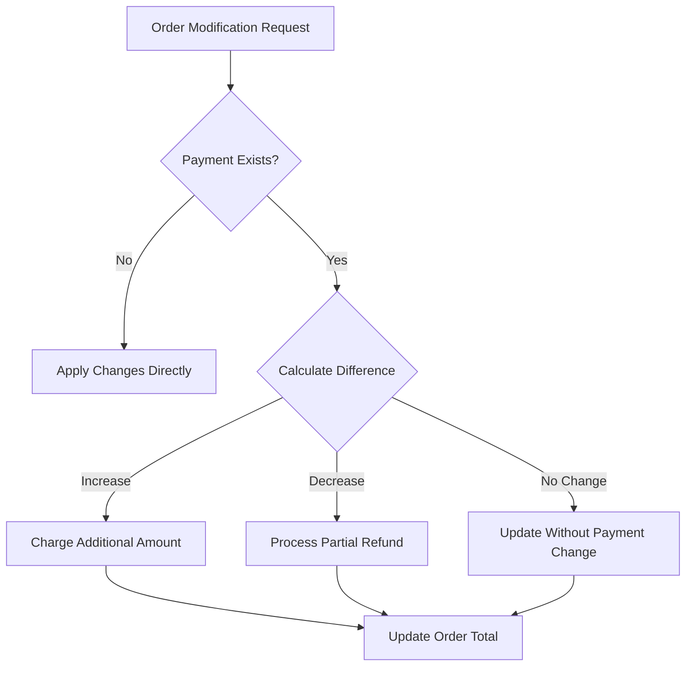

# Order Editing Strategy for Event-Sourced System

## Executive Summary

Order editing in an event-sourced system requires careful consideration of business rules, audit requirements, and payment handling. This document presents three strategic approaches and recommends the **Compensating Events Pattern** for the Colame restaurant management system.

## Current System Analysis

### Event-Sourcing Architecture
The order module uses event sourcing with:
- **OrderAggregate**: Domain logic and state transitions
- **Events**: Immutable record of all changes (OrderStarted, ItemsAdded, OrderConfirmed, etc.)
- **Projections**: Read models for queries
- **Status Lifecycle**: draft → placed → confirmed → preparing → ready → delivered → completed

### Key Constraints
1. **Immutable Event Stream**: Past events cannot be changed
2. **Payment Tracking**: PaymentTransaction model tracks all payment operations
3. **Audit Requirements**: Complete history needed for reconciliation
4. **Mobile Sync**: Events must replay correctly on offline devices

## Order Editing Strategies

### 1. ❌ Full Rollback & Recreate
**Approach**: Cancel the entire order and create a new one

**Pros**:
- Simple implementation
- Clear audit trail
- No complex state management

**Cons**:
- Loses order continuity (new order number)
- Disrupts kitchen workflow
- Payment refund/recharge complexity
- Poor UX for minor changes

**When to Use**: Never recommended for production

---

### 2. ⚠️ Version-Based Approach
**Approach**: Create new order versions while maintaining order ID

```php
// Events
OrderVersionCreated($orderId, $version, $basedOnVersion)
OrderVersionActivated($orderId, $version)
OrderVersionDiscarded($orderId, $version)
```

**Pros**:
- Maintains order identity
- Can preview changes before applying
- Supports complex approval workflows

**Cons**:
- High complexity
- Storage overhead
- Difficult mobile sync
- Confusing for staff

**When to Use**: Complex B2B scenarios with approval workflows

---

### 3. ✅ **RECOMMENDED: Compensating Events Pattern**
**Approach**: Record modifications as new events that adjust the current state

```php
// New Events
ItemsModified($orderId, $addedItems, $removedItems, $modifiedItems)
OrderAdjusted($orderId, $adjustmentReason, $adjustmentAmount)
PartialRefundProcessed($orderId, $amount, $items)
```

**Pros**:
- Natural fit for event sourcing
- Complete audit trail
- Graceful degradation
- Mobile-friendly (events replay correctly)
- Preserves order continuity

**Cons**:
- Requires careful event design
- Complex calculations for promotions

**Implementation**: See detailed implementation below

## Recommended Implementation Plan

### Phase 1: Core Modification Events

#### 1.1 New Events
```php
// ItemsModified Event
class ItemsModified extends ShouldBeStored {
    public function __construct(
        public string $aggregateRootUuid,
        public array $addedItems,      // New items to add
        public array $removedItems,    // Item IDs to remove
        public array $modifiedItems,   // Items with quantity/modifier changes
        public string $modifiedBy,
        public string $reason,
        public Carbon $modifiedAt
    ) {}
}

// PriceAdjusted Event
class PriceAdjusted extends ShouldBeStored {
    public function __construct(
        public string $aggregateRootUuid,
        public int $previousTotal,
        public int $newTotal,
        public int $adjustmentAmount,
        public string $adjustmentType, // 'discount', 'surcharge', 'correction'
        public string $reason
    ) {}
}
```

#### 1.2 Aggregate Methods
```php
class OrderAggregate {
    public function modifyItems(
        array $toAdd, 
        array $toRemove, 
        array $toModify,
        string $modifiedBy,
        string $reason
    ): self {
        // Validation based on current status
        if (!$this->canBeModified()) {
            throw new InvalidOrderStateException();
        }
        
        $this->recordThat(new ItemsModified(...));
        return $this;
    }
    
    private function canBeModified(): bool {
        return in_array($this->status, [
            'draft', 'placed', 'confirmed', 'preparing'
        ]);
    }
}
```

### Phase 2: Edit Restrictions by Status

| Status | Can Edit Items | Can Cancel | Can Adjust Price | Notes |
|--------|---------------|------------|------------------|--------|
| draft | ✅ Full | ✅ | ✅ | No restrictions |
| placed | ✅ Full | ✅ | ✅ | Before kitchen starts |
| confirmed | ✅ Limited | ✅ | ✅ | Only additions |
| preparing | ⚠️ Add only | ✅ | ✅ | Kitchen notified |
| ready | ❌ | ✅ | ✅ | Items ready |
| delivered | ❌ | ❌ | ✅ | Only price adjustments |
| completed | ❌ | ❌ | ⚠️ Manager | Requires authorization |
| cancelled | ❌ | N/A | ❌ | Terminal state |

### Phase 3: Payment Handling

#### 3.1 Payment States
```php
enum PaymentEditStrategy {
    case NO_PAYMENT;        // No payment yet, free to edit
    case ADJUST_DIFFERENCE; // Pay/refund the difference
    case VOID_AND_RECHARGE; // Cancel and create new payment
    case MANAGER_OVERRIDE;  // Manual adjustment with auth
}
```

#### 3.2 Payment Flow


### Phase 4: UI Implementation

#### 4.1 Edit Order Page (`resources/js/pages/order/edit.tsx`)
```typescript
interface OrderEditProps {
    order: OrderData;
    canEdit: EditPermissions;
    editHistory: OrderModification[];
}

// Key Features:
// 1. Show current items with strike-through for removed
// 2. Highlight new/modified items
// 3. Display price difference prominently
// 4. Required reason for modifications
// 5. Payment adjustment preview
```

#### 4.2 Edit Permissions
```typescript
interface EditPermissions {
    canAddItems: boolean;
    canRemoveItems: boolean;
    canModifyQuantity: boolean;
    canAdjustPrice: boolean;
    canCancel: boolean;
    requiresAuthorization: boolean;
    maxDiscountPercent: number;
}
```

### Phase 5: Kitchen & Waiter Notifications

```php
// When order is modified during preparation
class NotifyKitchenOfChanges {
    public function handle(ItemsModified $event) {
        // Send real-time update via WebSocket
        // Print modification slip on kitchen printer
        // Update kitchen display system
    }
}
```

## Implementation Timeline

### Sprint 1 (Week 1-2): Foundation
- [ ] Create ItemsModified and PriceAdjusted events
- [ ] Update OrderAggregate with modification methods
- [ ] Create edit permissions service
- [ ] Unit tests for event sourcing

### Sprint 2 (Week 3-4): Payment Integration
- [ ] Payment difference calculation
- [ ] Partial refund implementation
- [ ] Payment void and recharge flow
- [ ] Integration tests

### Sprint 3 (Week 5-6): UI & UX
- [ ] Create order/edit.tsx page
- [ ] Modification history component
- [ ] Payment adjustment preview
- [ ] Manager authorization modal

### Sprint 4 (Week 7-8): Kitchen Integration
- [ ] WebSocket notifications
- [ ] Kitchen printer updates
- [ ] Waiter mobile app sync
- [ ] End-to-end testing

## Security Considerations

1. **Authorization Levels**
   - Basic: Add items only
   - Supervisor: Remove items, apply discounts
   - Manager: Void orders, override payments

2. **Audit Trail**
   - All modifications logged with user, timestamp, reason
   - Payment adjustments require authorization code
   - Daily reconciliation reports

3. **Fraud Prevention**
   - Maximum discount limits
   - Suspicious pattern detection
   - Manager alerts for unusual modifications

## Alternative Approaches (Not Recommended)

### Snapshot & Restore
Create order snapshots at key points, restore to previous state if needed.
- **Why Not**: Violates event sourcing principles, loses granular history

### Shadow Orders
Create hidden "draft" orders for modifications, swap when confirmed.
- **Why Not**: Complex state management, confusing for staff

### Direct Event Editing
Modify past events directly in the event store.
- **Why Not**: Breaks immutability, corrupts event stream, impossible to sync

## Conclusion

The **Compensating Events Pattern** provides the best balance of:
- Audit trail completeness
- Implementation simplicity
- User experience
- System consistency
- Mobile device compatibility

This approach maintains the integrity of the event-sourced architecture while providing flexible order editing capabilities appropriate for a restaurant environment.

## Next Steps

1. Review and approve this strategy document
2. Create detailed technical specifications
3. Set up development environment for testing
4. Implement Phase 1 (Core Modification Events)
5. Conduct user acceptance testing with restaurant staff